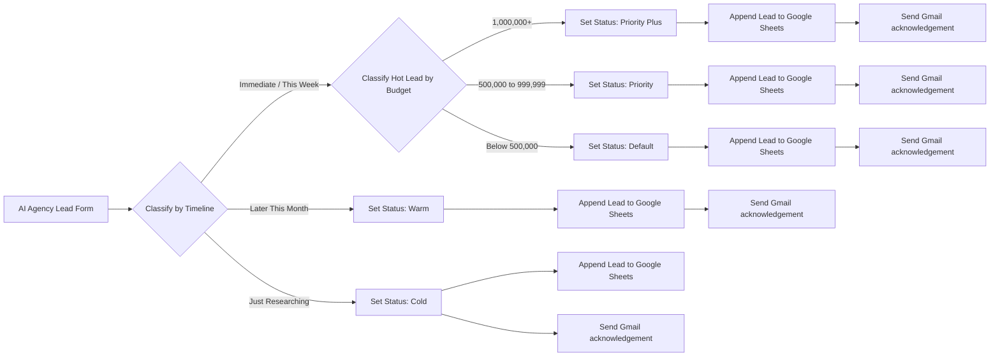

# AI Agency Lead Capture & Qualification

**Status:** Completed client-style portfolio project using synthetic test data  
**Stack:** n8n, Google Sheets, Gmail  
**Pattern:** Deterministic qualification, CRM persistence, automated acknowledgement

## Business problem

Businesses can generate leads successfully and still lose opportunities when every enquiry has to be reviewed, categorised, copied into a CRM or spreadsheet, and acknowledged manually.

This workflow automates the operational work after lead capture. It classifies structured enquiries by urgency and budget, records the final status, persists the complete lead record, and sends an acknowledgement immediately.

## Solution

## Why deterministic routing instead of AI classification?

The lead form uses controlled dropdown values for timeline and budget. Because the inputs are already structured, deterministic Switch-node logic is more transparent, easier to audit, and cheaper than introducing an LLM prediction step that is not needed.

AI is useful when interpretation is required. It should not replace clear business rules when the input already supports reliable logic.

## Qualification logic

### Timeline

| Form value | Classification |
|---|---|
| Immediately / This Week | Hot |
| Later This Month | Warm |
| Just Researching | Cold |

### Budget for Hot leads

| Budget | Final status |
|---|---|
| 1,000,000 and above | Priority Plus |
| 500,000 to 999,999 | Priority |
| Below 500,000 | Default |

Warm and Cold leads do not require budget reclassification.

## Data persisted

The workflow records the structured lead fields in Google Sheets:

- Full Name
- Email
- Service Type
- Timeline
- Budget
- Status

The internal status is retained for operational follow-up, while the customer-facing acknowledgement remains professional and does not expose the internal qualification logic.

## Testing evidence

All five final routing outcomes were tested successfully:

1. Priority Plus
2. Priority
3. Default
4. Warm
5. Cold

The test sequence validated:

- form submission
- correct Switch branch selection
- status assignment
- Google Sheets append
- Gmail acknowledgement

Detailed test notes: [`TESTING.md`](./TESTING.md)

## Reliability and design decisions

- Controlled dropdown inputs reduce ambiguity.
- Visible branching makes qualification rules inspectable.
- Each final route assigns a status before downstream actions.
- CRM persistence occurs before the email step.
- The workflow uses synthetic test data for portfolio evidence.
- Public evidence is sanitized and intentionally scoped rather than published as a turnkey deployment package.

## Public implementation evidence

This project publishes enough technical evidence to inspect the engineering decisions without shipping the complete reusable n8n workflow.

Published evidence includes:

- the architecture and node-flow model above
- exact business-routing rules
- persisted data contract
- five-route execution/test record
- reliability and implementation decisions

The complete deployable n8n export is intentionally **not included on the current public branch**. See [`workflow/README.md`](./workflow/README.md) for the publication rationale.

## Evidence package

| Evidence | Public status |
|---|---|
| Architecture / business logic | Published in this README |
| Five-route test record | [`TESTING.md`](./TESTING.md) |
| Complete reusable workflow export | Intentionally withheld from the current public branch |
| Original execution visuals | Recovered from project records and being curated for safe public publication |

## Portfolio positioning

This project demonstrates:

- n8n workflow orchestration
- business-rule mapping
- deterministic routing
- data transformation and status assignment
- CRM-style persistence
- automated customer acknowledgement
- execution testing across multiple outcomes
- evidence-conscious workflow publishing
