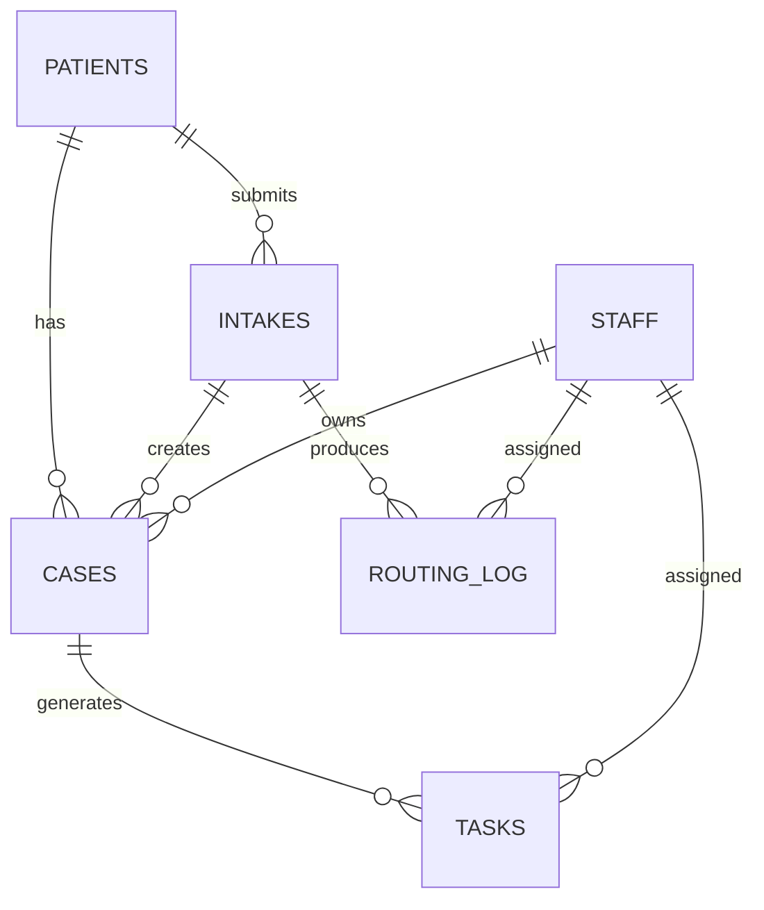

# MedFlow Airtable Data Model

This file documents the **live connected Airtable schema** for the MedFlow Intake OS portfolio project.

The current base contains **six related tables**:

1. `Patients`
2. `Intakes`
3. `Cases`
4. `Tasks`
5. `Routing_Log`
6. `Staff`

The records are synthetic portfolio data. This document describes structure and relationships only.

## Relationship overview

## 1. Patients

Purpose: synthetic patient identity, contact, consent, deduplication, and relationship anchor.

Representative fields:

- Patient ID
- Full Name
- First Name
- Last Name
- Email
- Phone
- Normalized Phone
- Date of Birth
- Is Returning
- Preferred Contact
- Consent Contact
- Consent Data
- Created At ISO
- Last Intake At ISO
- Cases
- Intakes

Key relationships:

- one patient can have multiple intakes
- one patient can have multiple cases

## 2. Intakes

Purpose: one record per submitted Jotform intake and the resulting routing decision context.

Representative fields:

- Intake ID
- Submitted At ISO
- Acuity Self Report
- Symptom Summary
- Symptom Duration
- Visit Type
- Service Needed
- Consent Contact
- Consent Data
- Is Follow-up
- Previous Visit Date
- Route
- Priority
- Calendar Hold
- Source
- Form Version
- Routing_Log
- Cases
- Patient

Key relationships:

- each intake links back to a patient
- an intake can create/link to a case
- routing evidence links back to the intake

## 3. Cases

Purpose: operational case management after intake routing.

Representative fields:

- Case ID
- Route
- Priority
- Status
- Opened At ISO
- Closed At ISO
- Notes
- Patient
- Intake
- Staff Owner
- Tasks

Key relationships:

- case links to patient and source intake
- case can have an assigned staff owner
- case can generate multiple tasks

## 4. Tasks

Purpose: assign and track follow-up actions generated from a case.

Representative fields:

- Task ID
- Task Type
- Status
- Due At ISO
- Completed At ISO
- Notes
- Case
- Assigned Staff

Key relationships:

- each task belongs to a case
- each task can be assigned to a staff member

## 5. Routing_Log

Purpose: audit and troubleshooting record for automation routing decisions.

Representative fields:

- Routing Log ID
- Result
- Route
- Priority
- Routed At ISO
- Action Taken
- Error Message
- Scenario Run ID
- Patient Email Masked
- Patient Phone Last4
- Consent Status
- Dedup Result
- Intake
- Assigned Staff

The log intentionally supports privacy-conscious traceability through masked identifiers rather than unnecessary full PII duplication.

## 6. Staff

Purpose: synthetic staff directory used for case ownership, task assignment, and routing.

Representative fields:

- Staff ID
- Name
- Role
- Email
- Specialty
- Active
- Routing_Log
- Cases
- Tasks

## Why the six-table design matters

The model separates different operational concerns instead of putting everything into a single patient record:

- **Patients** hold identity and consent state
- **Intakes** preserve each submission as an event
- **Cases** represent operational handling
- **Tasks** represent actionable work
- **Routing_Log** preserves automation evidence
- **Staff** provides ownership and assignment

This separation supports clearer auditability, repeat submissions, case/task lifecycle handling, and safer automation logic.

## Evidence note

An earlier recovered documentation snapshot referenced only `Patients`, `Intakes`, `Routing_Log`, and `Staff`. Direct inspection of the connected Airtable base confirms that the implemented/current schema also contains `Cases` and `Tasks`. The live base is therefore the stronger source of truth for the portfolio data model.
