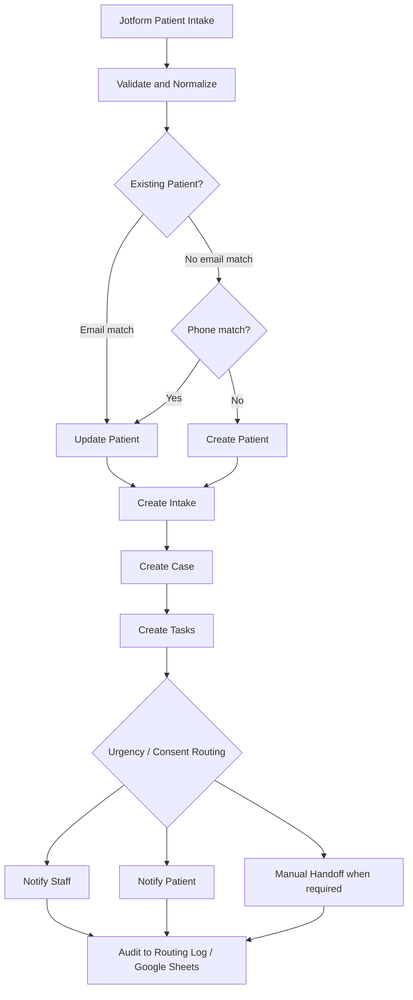

# MedFlow Intake OS

**Status:** Completed client-style portfolio system using synthetic healthcare data  
**Stack:** Jotform, Make.com, Airtable, Google Sheets, Gmail/Outlook, Google Calendar  
**Pattern:** Intake validation, deduplication, linked records, conditional routing, audit logging, human handoff

## Business problem

Operational intake becomes fragile when form submissions are manually copied between spreadsheets, case records, task lists, and staff inboxes. Duplicate patient records, incomplete handoffs, missed urgency signals, and poor auditability are common failure modes.

MedFlow Intake OS demonstrates how a healthcare-style intake process can be structured as an auditable automation system without claiming to be a production clinical platform.

## Solution architecture

## Data model

The portfolio operating model uses linked records across:

- Patients
- Intakes
- Cases
- Tasks
- Routing_Log
- Staff

This separates identity, each intake event, the resulting operational case, assigned work, audit history, and staff ownership rather than forcing everything into one flat table.

## Key implementation logic

### Duplicate protection

Patient lookup uses:

1. email as the primary match
2. phone as a fallback match
3. create only when no existing patient match is found

The intent is to reduce duplicate records before downstream case creation.

### Conditional routing

The workflow evaluates intake context such as urgency and consent before determining the correct operational path. Jotform can pre-sort the intake experience, while Make.com performs the final workflow routing.

### Human handoff

The project deliberately preserves manual intervention where automated processing should not make an unsupported decision. This is a core design principle, especially for healthcare-style workflows.

### Auditability

Routing outcomes are written to structured records so the operational path can be inspected after execution. Google Sheets is used as an additional audit/backup surface in the portfolio build.

## Privacy and scope

- Synthetic data only for portfolio demonstrations.
- This is not presented as a HIPAA-compliant production system.
- No real patient records are included in this repository.
- Public documentation avoids account IDs, credentials, and private endpoints.

## Engineering evidence

The original project package includes detailed design material covering:

- business problem summary
- system architecture
- workflow diagrams
- Jotform intake structure
- Jotform conditional branching
- Airtable CRM schema
- field mapping
- Make.com scenario blueprint
- routing rules
- testing and presentation guidance

## Why this project matters

MedFlow demonstrates more than connecting apps. It shows:

- data-model design
- record identity and deduplication
- cross-system field mapping
- conditional workflow orchestration
- linked-record creation
- notification design
- human-in-the-loop control
- audit logging
- privacy-conscious portfolio testing

## Implementation status

This project is a portfolio/client-style implementation built with synthetic data. It demonstrates system architecture and workflow engineering, not a claim of clinical deployment.
