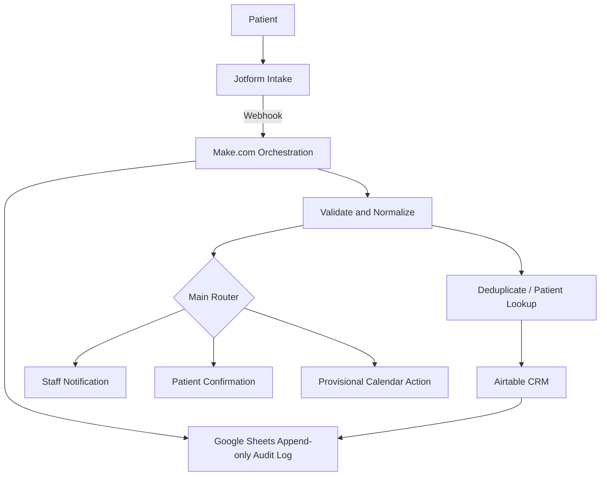

# MedFlow Intake OS

**Status:** Completed client-style portfolio system using synthetic healthcare data  
**Stack:** Jotform, Make.com, Airtable, Google Sheets, Gmail/Outlook, Google Calendar  
**Pattern:** Intake validation, deduplication, routing, CRM writes, audit logging, notifications, provisional scheduling

## Business problem

MedFlow Health is a simulated early-stage telehealth and in-person clinic startup. The portfolio scenario models a small operations team receiving patient intake through a website form without a dedicated EHR/CRM.

The manual process creates operational risk: intake data can be copied inconsistently, duplicate patient records can be created, urgent submissions can be missed, consent can be mishandled, and staff can lack a reliable audit trail.

This project demonstrates an auditable automation design for that intake process. It is not presented as a production clinical system.

## System architecture

The recovered project documentation defines MedFlow as an event-driven pipeline:



Make.com orchestrates validation, deduplication, routing, CRM writes, audit logging, and notifications. Airtable is the system of record. Google Sheets is the append-only audit log. Gmail/Outlook and Google Calendar support communication and provisional scheduling.

## Airtable data model

The original documented CRM schema contains four tables:

- `Patients`
- `Intakes`
- `Routing_Log`
- `Staff`

This is the table structure supported by the recovered project package and is the structure documented here.

## Key implementation logic

### Duplicate protection

The workflow searches for an existing patient before creating a new identity record. The design uses email as the primary lookup and phone as a fallback where required.

### Jotform pre-sorting

Jotform conditional logic keeps the intake form focused, surfaces emergency guidance where appropriate, and displays follow-up questions only when needed.

The form **pre-sorts** the submission. Make.com remains responsible for the final operational routing decision.

### Make.com routing precedence

The recovered scenario documentation defines a top-down routing model. Higher-priority rules win. The first documented controls include:

1. required fields missing → `NEEDS_REVIEW`
2. contact or data consent missing → `MISSING_CONSENT`
3. downstream urgency / follow-up routes evaluated after those safety controls

This ordering prevents incomplete or non-consented submissions from being treated as ordinary scheduling requests.

### Audit logging

The Google Sheets audit log is designed as append-only operational evidence. It records what happened during the scenario without duplicating unnecessary clinical detail.

The documentation explicitly uses a minimal-data-routing approach, including masked identifiers in the audit surface rather than copying full clinical narratives into the log.

### Staff notifications

Staff email templates are designed to carry only the operational information needed for action. Detailed intake information remains in Airtable and is accessed through the record rather than copied unnecessarily into email.

### Patient communication

Patient-facing templates are designed to acknowledge the intake without implying a diagnosis. The recovered documentation explicitly avoids echoing unnecessary clinical detail back into email.

## Field mapping

The project documents an end-to-end integration contract:

```text
Jotform unique name
        ↓
Make.com variable / transform
        ↓
Airtable field
        ↓
Audit-log column where applicable
```

This makes cross-system data mapping explicit rather than relying on undocumented visual connections.

## Make.com scenario blueprint

Scenario name in the recovered documentation:

**MedFlow - Intake Orchestration v1**

The project package contains a logic-level Make.com blueprint describing modules in build order and their key mappings. It intentionally does not claim that an account-specific Make export can be shared safely without reviewing connection details.

## Test data

The project includes a synthetic patient test set designed to exercise different routes. Test identities use fictional names, `.example` email addresses, and reserved-style test phone numbers.

No real patient information should be used in the public portfolio.

## Privacy and scope

- Synthetic data only.
- HIPAA-aware design discussion, **not** a claim of HIPAA compliance.
- No real patient information in the public repository.
- Minimal-data-routing is used for notifications and audit logs.
- Credentials, account IDs, private endpoints, and connection details are excluded from public artifacts.

## Recovered engineering package

The original project package contains documentation for:

- business problem summary
- system architecture
- Mermaid diagrams
- Jotform intake form structure
- Jotform conditional branching logic
- Airtable CRM schema
- CRM field mapping
- Make.com scenario blueprint
- routing rules
- synthetic test data
- Google Sheets audit-log design
- staff notification templates
- patient confirmation templates
- QA / test guidance
- presentation / handover material

## Skills demonstrated

- workflow architecture
- Jotform conditional logic
- Make.com orchestration
- Airtable CRM design
- deduplication
- cross-system field mapping
- consent-aware routing
- audit logging
- notification design
- human-safe operational controls
- synthetic test-data design
- documentation and handover
