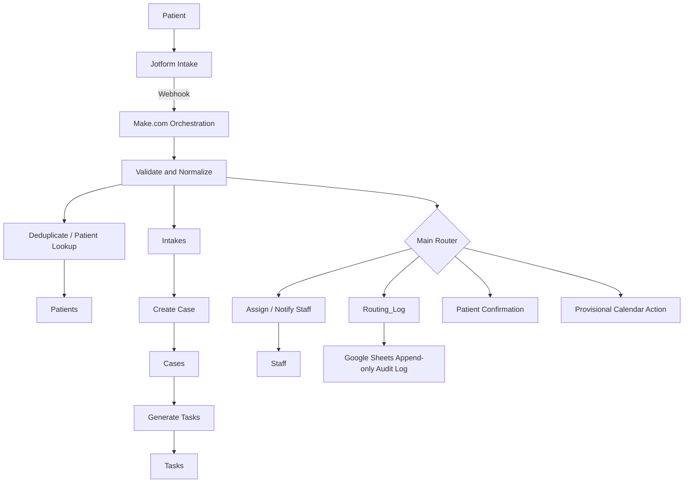

# MedFlow Intake OS

**Status:** Completed client-style portfolio system using synthetic healthcare data  
**Stack:** Jotform, Make.com, Airtable, Google Sheets, Gmail/Outlook, Google Calendar  
**Pattern:** Intake validation, deduplication, case creation, task generation, routing, CRM writes, audit logging, notifications, provisional scheduling

## Business problem

MedFlow Health is a simulated early-stage telehealth and in-person clinic startup. The portfolio scenario models a small operations team receiving patient intake through a website form without a dedicated EHR/CRM.

The manual process creates operational risk: intake data can be copied inconsistently, duplicate patient records can be created, urgent submissions can be missed, consent can be mishandled, and staff can lack a reliable audit trail.

This project demonstrates an auditable automation design for that intake process. It is not presented as a production clinical system.

## System architecture



Make.com orchestrates validation, deduplication, patient create/update, intake creation, case creation, task generation, routing, notifications, and audit logging. Airtable is the operational system of record. Google Sheets provides the append-only audit surface used for portfolio-visible traceability.

## Airtable data model

I re-verified the live connected Airtable base rather than relying only on the recovered documentation. The current MedFlow CRM contains **six tables**:

1. `Patients`
2. `Intakes`
3. `Cases`
4. `Tasks`
5. `Routing_Log`
6. `Staff`

The tables are linked relationally rather than operating as isolated sheets:

- `Patients` links to `Intakes` and `Cases`
- `Intakes` links to the `Patient`, resulting `Cases`, and `Routing_Log`
- `Cases` links to the `Patient`, source `Intake`, `Staff Owner`, and generated `Tasks`
- `Tasks` links to the parent `Case` and `Assigned Staff`
- `Routing_Log` links to the source `Intake` and `Assigned Staff`
- `Staff` links back to `Cases`, `Tasks`, and `Routing_Log`

Detailed schema notes: [`DATA_MODEL.md`](./DATA_MODEL.md)

## Key implementation logic

### Duplicate protection

The workflow searches for an existing patient before creating a new identity record. Email is the primary lookup and normalized phone is available as a fallback matching key.

### Intake persistence

Each submitted intake is stored separately from the patient identity record. The live `Intakes` table contains fields for self-reported acuity, symptom summary, duration, visit type, service needed, consent, route, priority, source, form version, and linked patient/case/routing records.

### Case creation

Operational handling is represented through a separate `Cases` table. Cases track route, priority, status, opened/closed timestamps, notes, patient, source intake, staff owner, and related tasks.

### Task generation

Follow-up actions are represented through the `Tasks` table rather than being embedded only in case notes. Tasks can be assigned to synthetic staff and carry type, status, due/completed timestamps, notes, and the parent case relationship.

### Jotform pre-sorting

Jotform conditional logic keeps the intake form focused, surfaces emergency guidance where appropriate, and displays follow-up questions only when needed.

The form pre-sorts the submission. Make.com remains responsible for the final operational routing decision.

### Routing precedence

The recovered scenario documentation defines a top-down routing model. Higher-priority controls include:

1. required fields missing → `NEEDS_REVIEW`
2. contact or data consent missing → `MISSING_CONSENT`
3. downstream urgency / follow-up routes evaluated after those safety controls

This ordering prevents incomplete or non-consented submissions from being treated as ordinary scheduling requests.

### Audit logging

`Routing_Log` stores operational routing evidence including route, priority, result, action taken, scenario run ID, masked patient email, phone last four digits, consent status, deduplication result, source intake, assigned staff, and error information.

Google Sheets provides an additional append-only audit / backup layer.

### Staff notifications

Staff email templates are designed to carry only the operational information needed for action. Detailed intake information remains in Airtable and is accessed through the record rather than copied unnecessarily into email.

### Patient communication

Patient-facing templates acknowledge the intake without implying a diagnosis or copying unnecessary clinical detail into email.

## Field mapping

The project uses an explicit cross-system mapping contract:

```text
Jotform unique name
        ↓
Make.com variable / transform
        ↓
Airtable field / linked record
        ↓
Audit-log column where applicable
```

## Make.com scenario blueprint

Scenario name in the recovered documentation:

**MedFlow - Intake Orchestration v1**

The project package contains a logic-level Make.com blueprint describing modules in build order and their key mappings. An account-specific Make export is not published until connection-specific details can be verified and sanitized.

## Test data

The project uses synthetic patient and staff data for portfolio testing. No real patient information should be used in the public portfolio.

## Privacy and scope

- Synthetic data only.
- HIPAA-aware design discussion, **not** a claim of HIPAA compliance.
- No real patient information in the public repository.
- Minimal-data routing is used for notifications and audit logs.
- Credentials, account IDs, private endpoints, and connection details are excluded from public artifacts.

## Recovered engineering package

The project evidence includes:

- business problem summary
- system architecture
- Jotform intake structure and conditional logic
- six-table Airtable CRM schema
- linked-record relationships
- field mapping
- Make.com scenario blueprint
- routing rules
- synthetic test data
- Google Sheets audit-log design
- staff notification templates
- patient confirmation templates
- QA / test guidance
- presentation / handover material

Detailed recovered implementation notes: [`IMPLEMENTATION_NOTES.md`](./IMPLEMENTATION_NOTES.md)

## Evidence package

| Evidence | Public status |
|---|---|
| Architecture and routing model | Published in this README |
| Live Airtable six-table schema | Verified against connected Airtable base |
| Detailed relational schema | [`DATA_MODEL.md`](./DATA_MODEL.md) |
| Recovered implementation notes | [`IMPLEMENTATION_NOTES.md`](./IMPLEMENTATION_NOTES.md) |
| Account-specific Make export | Not published until connection-specific details can be verified and sanitized |

## Skills demonstrated

- workflow architecture
- Jotform conditional logic
- Make.com orchestration
- Airtable relational CRM design
- deduplication
- linked-record modelling
- case management
- task generation and assignment
- cross-system field mapping
- consent-aware routing
- audit logging
- notification design
- human-safe operational controls
- synthetic test-data design
- documentation and handover
