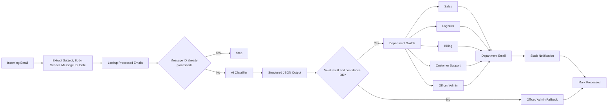

# Architecture and Control Design

## System objective

Route incoming business email to the correct operational department while preventing duplicate processing and preserving a safe fallback when the AI result is invalid or low-confidence.

## End-to-end architecture



## Department model

The workflow supports five operational destinations:

1. Sales
2. Logistics
3. Billing
4. Customer Support
5. Office / Admin

Office / Admin is also the default/fallback path for results that should not be trusted for specialist routing.

## Duplicate protection

The workflow checks the Gmail/message ID against a processed-email data store before classification.

If the message is already present, processing stops. This protects against repeated triggers or accidental reprocessing.

## AI classification contract

The classification step is designed to produce structured JSON containing:

- `department`
- `confidence`
- `reason`

The workflow then validates that result before using it for deterministic routing.

## Confidence fallback

A classifier result should not automatically drive downstream business actions merely because an LLM returned text.

If the structured result is invalid or confidence is below the configured threshold, the workflow routes to **Office / Admin** instead of guessing.

## Deterministic department routing

After the AI interpretation step, a Switch node handles the actual department routing. This separates probabilistic interpretation from deterministic workflow execution.

## Action layer

Each department path is designed to:

1. send or forward the email to the relevant department destination
2. send a corresponding Slack notification
3. write processing metadata to the data table

The log model includes fields such as:

- Email ID
- Department
- Processed At
- Sender
- Subject
- Status

## Failure path

The architecture also defines an exception path for AI API or workflow failures:

```text
AI API / workflow error
→ do not mark email as processed
→ write error record
→ notify Office / Admin in Slack
```

This avoids falsely recording a failed message as successfully handled.

## Why this architecture matters

The project demonstrates a practical hybrid pattern:

- AI for ambiguous language interpretation
- deterministic logic for downstream routing
- duplicate protection before expensive processing
- fallback handling for uncertainty
- explicit failure behavior
- logging for auditability

## Evidence boundary

This is a structured AI-automation project implementation. Public documentation describes the verified architecture and controls without claiming enterprise production deployment.
