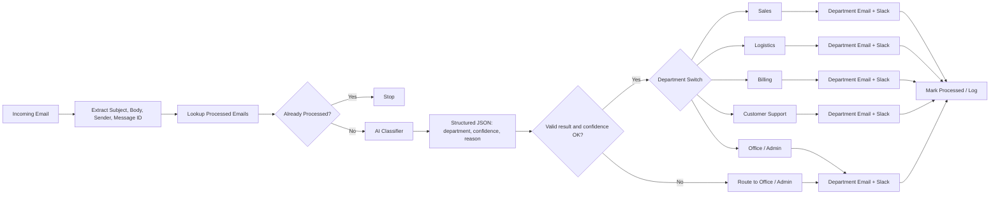

# Cupid Errands Intelligent Email Routing

**Status:** Completed structured AI automation project  
**Stack:** n8n, OpenRouter, Email/Gmail, Slack, structured JSON output  
**Pattern:** AI intent classification, duplicate protection, confidence fallback, department routing, logging

## Business problem

A shared inbox becomes a bottleneck when staff must manually read every message, decide which department owns it, forward it, notify the right team, and avoid processing the same email twice.

This workflow automates that routing problem while keeping a safe default path for uncertain classifications.

## Departments

The routing model supports five operational destinations:

1. Sales
2. Logistics
3. Billing
4. Customer Support
5. Office / Admin

Office / Admin also acts as the fallback route when classification confidence is insufficient or the result is invalid.

## Architecture

## Duplicate protection

Before AI classification, the workflow checks the incoming Gmail/message ID against a processed-email data store.

If the ID already exists, processing stops. This prevents repeated forwarding and repeated Slack notifications.

## AI classification contract

The classifier receives the email subject and body and returns structured data containing:

- `department`
- `confidence`
- `reason`

Structured output makes the downstream workflow deterministic. The AI interprets the message, but the routing logic is still controlled by explicit workflow rules.

## Confidence and fallback handling

A classification is not accepted blindly.

If the result is invalid or below the configured confidence threshold, the workflow routes the message to **Office / Admin** rather than guessing a specialist department.

This creates an operational safety net for ambiguous messages.

## Department actions

Each department route supports two actions:

- send/forward to the relevant department email
- notify the relevant Slack channel

After successful routing, the email is marked as processed and logged with operational metadata such as message ID, department, sender, subject, processing time, and status.

## Failure path

The architecture includes a separate exception pattern:

- AI API failure or workflow error
- do not mark the email as processed
- log the error
- notify Office / Admin in Slack

This matters because marking a failed email as processed would hide work that still needs attention.

## Engineering decisions

- AI is used only for unstructured intent interpretation.
- Duplicate protection happens before expensive AI work.
- Structured output separates model reasoning from workflow execution.
- Low-confidence results fall back to a human-safe operational route.
- Failed runs are not falsely recorded as successful.
- Logging provides an audit trail for downstream review.

## Portfolio evidence

The project evidence includes a detailed workflow architecture diagram covering:

- inbox intake and field extraction
- duplicate protection
- AI classification
- confidence validation
- five-way department switch
- department email and Slack actions
- processed-email logging
- fallback and failure paths

## Skills demonstrated

- n8n workflow orchestration
- AI intent classification
- prompt / structured-output design
- JSON handling
- deduplication
- confidence gating
- operational fallbacks
- Slack and email integration patterns
- error handling
- audit logging
