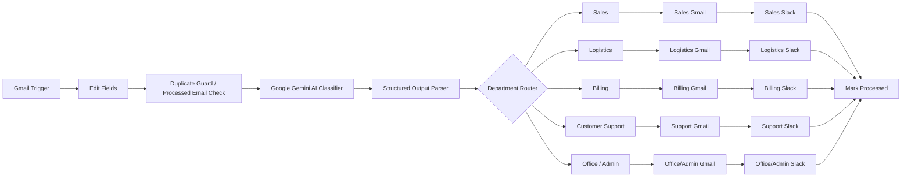

# Cupid Errands Intelligent Email Routing

**Status:** Completed AI automation project  
**Stack:** n8n, Google Gemini, Gmail, Google Sheets, Slack, structured output  
**Pattern:** AI intent classification, duplicate protection, deterministic department routing, fallback handling, processed-state tracking

## Business problem

A shared inbox becomes a bottleneck when staff must manually read every message, determine which department owns it, forward it, notify the right team, and avoid processing the same email twice.

This workflow automates that routing problem while keeping operational control explicit and inspectable.

## Departments

The workflow routes messages to five operational destinations:

1. Sales
2. Logistics
3. Billing
4. Customer Support
5. Office / Admin

Office / Admin also provides the default operational path when the classification cannot be mapped safely to a specialist route.

## Final workflow architecture

Detailed control architecture: [`ARCHITECTURE.md`](./ARCHITECTURE.md)

## Duplicate protection

Before classification, the workflow checks the incoming message identifier against the processed-email tracking layer. Messages that have already been handled are not routed again, preventing repeated forwarding and repeated Slack notifications.

## AI classification contract

Google Gemini interprets the email and returns structured output for downstream execution. The classification layer produces fields such as:

- `department`
- `confidence`
- `reason`

The LLM is responsible for interpreting unstructured intent. Routing remains controlled by explicit n8n workflow logic.

## Deterministic routing

The Department Router maps the structured `department` value to the corresponding branch. This keeps the execution path transparent even though AI is used upstream for interpretation.

Each branch performs the department-specific delivery actions before the workflow updates its processed state.

## Delivery and state tracking

Each route triggers:

- department-specific Gmail delivery
- department-specific Slack notification
- final processed-state update

The final state update closes the loop and supports duplicate prevention on later runs.

## Engineering decisions

- AI is used for unstructured email interpretation, not for uncontrolled execution.
- Duplicate protection occurs before repeated downstream actions.
- Structured output creates a machine-readable boundary between AI interpretation and workflow routing.
- Department execution is deterministic and inspectable.
- Office / Admin provides an operational fallback path.
- Processed-state tracking supports traceability and prevents repeat handling.

## Public evidence

The public portfolio includes the verified final workflow architecture and an actual n8n workflow capture showing the implemented Gmail, Gemini, routing, Slack and processed-state branches.

## Skills demonstrated

- n8n workflow orchestration
- Google Gemini integration
- AI intent classification
- structured-output design
- JSON handling
- deduplication
- deterministic routing
- Gmail and Slack integrations
- fallback design
- operational state tracking
