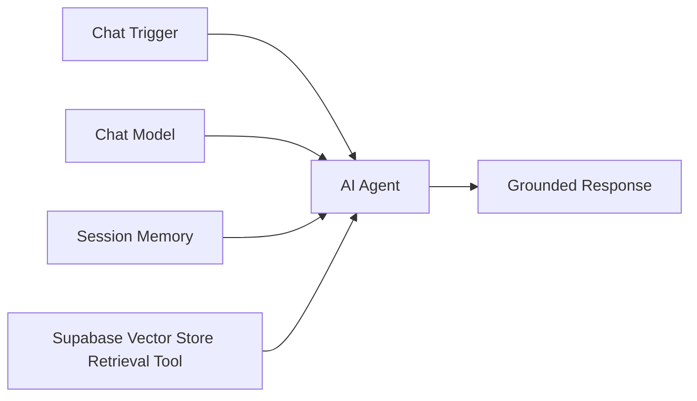

# RAG Ingestion and Retrieval Architecture

## Classification

**Structured training implementation**

This project demonstrates hands-on RAG architecture and testing. It is intentionally not described as an enterprise production RAG deployment.

## Ingestion workflow


The implementation used a Google Drive-triggered ingestion path, document download, loading/chunking, OpenAI embeddings, and Supabase vector storage.

The verified classroom build produced multiple chunks from a source document and inserted those records into the Supabase `documents` table with content, metadata, and embedding vectors.

## Retrieval workflow



The agent uses a retrieval tool connected to the Supabase Vector Store. The user question is embedded, relevant document chunks are retrieved, and the result is passed back into the agent context before response generation.

## Technologies demonstrated

- n8n AI Agent
- OpenRouter chat model integration
- OpenAI embeddings
- Supabase / pgvector
- vector similarity retrieval
- document ingestion
- metadata-aware stored chunks
- session memory
- grounded-response testing

## Supabase architecture

The training implementation created a vector-enabled `documents` table with fields for:

- `id`
- `content`
- `metadata`
- `embedding`

A similarity-search function was also configured to compare stored embeddings with a query embedding and support metadata filtering.

## Validation

The implementation was tested by:

- confirming document chunks were inserted into Supabase
- inspecting stored content, metadata, and embeddings
- connecting the vector store as an AI Agent retrieval tool
- asking questions grounded in the ingested source document
- checking whether the response relied on retrieved knowledge rather than unsupported general output

## Prompt-security learning

A separate AI Agent exercise exposed a system-prompt leakage issue during prompt-injection testing. The configuration was corrected and retested.

This is documented as a training finding rather than represented as proof of a hardened production security architecture.

## Engineering takeaway

The important architectural distinction is that the model is not being trained on the source document. The system performs retrieval at query time:

```text
Documents
→ chunks
→ embeddings
→ vector storage

User query
→ query embedding
→ similarity retrieval
→ relevant context
→ model response
```

That separation between ingestion, retrieval, and generation is the core RAG pattern demonstrated by this project.
