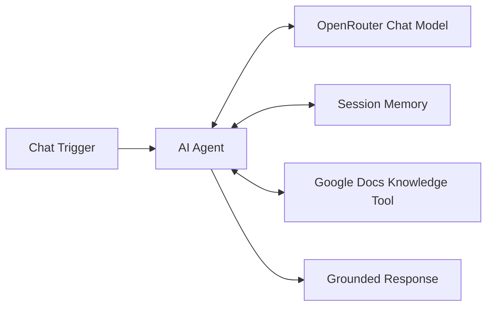
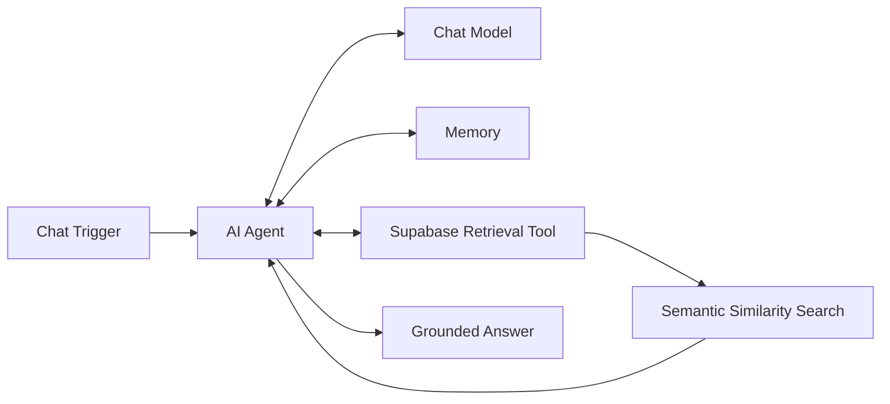

# RAG & AI Agent Workflows

**Status:** Completed training implementation  
**Stack:** n8n, OpenRouter, OpenAI Embeddings, Supabase Vector Store, Google Drive, Google Docs, AI Agent memory  
**Pattern:** Tool-connected retrieval, vector ingestion, semantic search, grounded answering

## Scope

This project documents practical Retrieval-Augmented Generation (RAG) and AI-agent workflows implemented during structured training. It is deliberately labelled as a training implementation rather than commercial production experience.

The work covered three related architectures.

## 1. Google Docs knowledge chatbot

The chatbot uses an AI Agent with model access, memory, and a Google Docs retrieval tool. The agent is instructed to use the knowledge source rather than answering from unsupported assumptions.

## 2. Vector ingestion pipeline

The ingestion workflow demonstrates the data path from a newly created document to vector storage:

- detect file creation in Google Drive
- download the file
- load and split document content
- convert chunks to embeddings
- persist vectors and metadata in Supabase

## 3. Vector retrieval chatbot

The retrieval workflow converts the user's question into a search against the vector store, retrieves relevant document chunks, and makes that context available to the agent before response generation.

Detailed ingestion / retrieval evidence: [`INGESTION_AND_RETRIEVAL.md`](./INGESTION_AND_RETRIEVAL.md)

## Technologies demonstrated

- n8n AI Agent workflows
- OpenRouter chat-model access
- OpenAI embedding model integration
- Google Docs as a knowledge source
- Google Drive document ingestion
- Supabase / pgvector storage
- vector similarity retrieval
- agent session memory
- structured system prompting

## Retrieval concepts demonstrated

### Chunking and embeddings

Documents are split into smaller retrievable units before embedding. Embeddings convert those chunks into vectors that can be compared semantically with a user's query.

### Vector storage

Supabase stores the document content, metadata, and embedding vectors used for similarity search.

### Grounded response generation

The agent retrieves context from the connected knowledge source before answering, reducing reliance on unsupported model memory.

## Security testing

The training implementation also included controlled prompt-injection testing. A system-prompt exposure problem was observed during testing and the configuration was subsequently corrected and retested.

This is useful portfolio evidence because it demonstrates that an AI workflow should be tested not only for successful answers but also for instruction leakage and adversarial input.

## Evidence package

| Evidence | Public status |
|---|---|
| Architecture overview | Published in this README |
| Ingestion and retrieval implementation notes | [`INGESTION_AND_RETRIEVAL.md`](./INGESTION_AND_RETRIEVAL.md) |
| Training execution screenshots | Recovered from training/project records and being curated for safe publication |
| Account-specific workflow export | Not published until credential/configuration references are fully reviewed |

## Implementation status

This repository does **not** claim an enterprise production RAG deployment. It documents a hands-on training implementation that demonstrates practical knowledge of:

- ingestion pipelines
- embeddings
- vector databases
- semantic retrieval
- agent memory
- tool use
- grounded answering
- prompt-injection testing

## Skills demonstrated

- RAG architecture
- AI-agent orchestration
- vector retrieval
- embeddings
- Supabase
- OpenRouter
- OpenAI embeddings
- n8n AI nodes
- prompt engineering
- security-minded AI workflow testing
