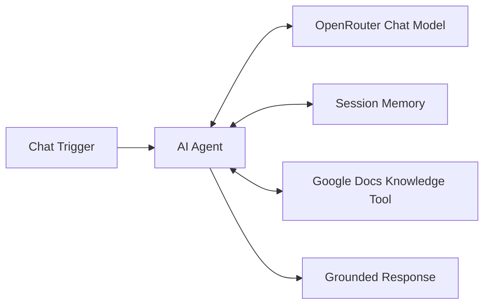
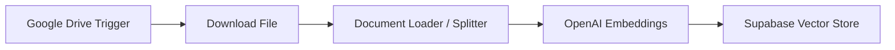
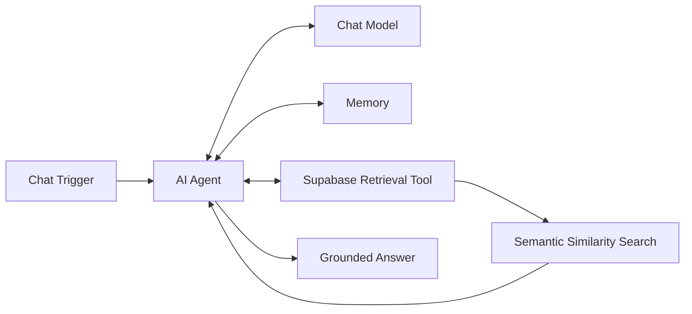

# RAG & AI Agent Workflows

**Status:** Completed training implementation  
**Stack:** n8n, OpenRouter, OpenAI Embeddings, Supabase Vector Store, Google Drive, Google Docs, AI Agent memory  
**Pattern:** Tool-connected retrieval, vector ingestion, semantic search, grounded answering

## Scope

This project documents practical Retrieval-Augmented Generation (RAG) and AI-agent workflows implemented during structured training. It is deliberately labelled as a training implementation rather than commercial production experience.

The work covered three related architectures.

## 1. Google Docs knowledge chatbot

The chatbot combines an AI Agent with model access, session memory and a Google Docs retrieval tool. The system is configured to use the connected knowledge source rather than rely on unsupported assumptions.

## 2. Vector ingestion pipeline

The ingestion flow covers:

- detecting new source documents in Google Drive
- downloading document content
- loading and splitting content into retrievable units
- generating embeddings
- storing document chunks, metadata and vectors in Supabase

## 3. Vector retrieval chatbot

The retrieval workflow uses semantic similarity search against the vector store, returns relevant document chunks and makes that context available to the agent before response generation.

Detailed ingestion and retrieval implementation: [`INGESTION_AND_RETRIEVAL.md`](./INGESTION_AND_RETRIEVAL.md)

## Technologies demonstrated

- n8n AI Agent workflows
- OpenRouter chat-model access
- OpenAI embeddings
- Google Docs knowledge tooling
- Google Drive document ingestion
- Supabase / pgvector storage
- vector similarity retrieval
- agent session memory
- structured system prompting

## Security testing

The training implementation included controlled prompt-injection testing. A system-prompt exposure issue was identified during testing, the configuration was corrected, and the workflow was retested.

This is relevant engineering evidence because AI workflows need validation for instruction leakage and adversarial input as well as normal successful responses.

## Public evidence

The public portfolio presents the verified ingestion and retrieval architecture, vector-store implementation evidence, grounded retrieval flow and prompt-injection correction. Account-specific credentials, private document identifiers and environment configuration are excluded.

## Implementation status

This is a hands-on training implementation, not a claim of an enterprise production RAG deployment. It demonstrates practical knowledge of ingestion pipelines, embeddings, vector databases, semantic retrieval, agent memory, tool use, grounded answering and AI workflow security testing.

## Skills demonstrated

- RAG architecture
- AI-agent orchestration
- vector retrieval
- embeddings
- Supabase / pgvector
- OpenRouter
- OpenAI embeddings
- n8n AI nodes
- prompt engineering
- security-minded AI workflow testing
