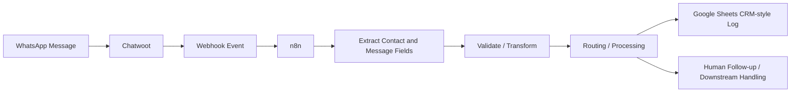

# WhatsApp / Chatwoot CRM Automation

**Status:** Independent portfolio/development implementation  
**Stack:** n8n, Chatwoot, WhatsApp, webhooks, Google Sheets, Docker  
**Pattern:** Messaging ingestion, contact extraction, routing, CRM-style logging, human downstream handling

## Business problem

Customer conversations can become operationally messy when messages live only inside a messaging platform and important contact or request details are not captured in a structured system.

This project demonstrates a webhook-driven workflow that receives messaging events, extracts useful contact and conversation data, prepares it for downstream routing, and records structured information for CRM-style follow-up.

## Architecture

## Workflow responsibilities

The implementation work included patterns for:

- webhook ingestion from the messaging environment
- extracting message and contact details
- normalising data for downstream actions
- routing / processing logic
- CRM-style logging in Google Sheets
- preserving human handling where required

## Infrastructure context

The workflow was developed within a self-hosted automation environment rather than only inside a hosted n8n editor.

The broader environment included:

- n8n
- PostgreSQL
- Redis
- Chatwoot
- Chatwoot Sidekiq
- Docker-based services

This gives the project an infrastructure dimension in addition to the workflow logic itself.

## Evidence boundary

An older development environment contained multiple workflows, including messaging and order-processing experiments. Not every workflow in that environment should be interpreted as a production deployment.

This case study therefore makes a narrower claim: hands-on work with WhatsApp/Chatwoot webhook automation, contact/message extraction, routing, structured CRM-style logging, and self-hosted n8n operations.

## Difference from the WhatsApp AI Order Processor

This project is separate from the standalone [`whatsapp-order-processor`](https://github.com/Dudubynatur3/whatsapp-order-processor) repository.

- **WhatsApp / Chatwoot CRM Automation:** messaging operations, webhook ingestion, contact extraction, CRM-style handling.
- **WhatsApp AI Order Processor:** a packaged client-style order workflow with AI parsing, payment-flow design, and fulfilment notification.

Keeping these separate avoids combining different implementations into one exaggerated project claim.

## Skills demonstrated

- n8n workflow engineering
- webhooks
- WhatsApp integration patterns
- Chatwoot
- contact and message data extraction
- structured logging
- CRM-style workflows
- data transformation
- human handoff
- Docker-based automation infrastructure
