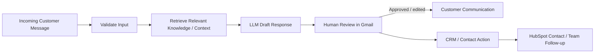

# AI-Assisted Customer Support with Human Review

**Status:** Independent portfolio workflow pattern  
**Stack:** LLM integration, knowledge retrieval, Gmail, HubSpot, human review  
**Pattern:** Validate, retrieve context, draft with AI, human approval, CRM follow-up

## Business problem

AI can accelerate customer-support work, but fully automatic customer-facing replies create unnecessary risk when the model misunderstands a request, uses incomplete knowledge, or produces wording that should be reviewed before it reaches a customer.

This workflow demonstrates a controlled support pattern where AI assists the operator without removing human accountability.

## Architecture

## Design principle

The important engineering decision is the **human-review boundary**.

The model generates a draft, not an uncontrolled final response. A person reviews the output before external communication.

This pattern is useful when:

- accuracy matters more than maximum automation
- knowledge sources may change
- customer messages can be ambiguous
- tone and policy compliance require oversight
- the workflow is being introduced incrementally

## Workflow responsibilities

- validate incoming message data
- retrieve relevant knowledge or context
- generate an AI-assisted response draft
- surface the draft for human review
- preserve the ability to edit or reject the draft
- create or update downstream CRM/contact information where appropriate
- notify or hand off to the relevant team

## Why human-in-the-loop matters

A reliable AI workflow should define where machine autonomy stops.

In this implementation, AI performs the repetitive drafting and context synthesis, while a human remains responsible for the external response. This reduces the risk of hallucinated or inappropriate customer communication.

## Skills demonstrated

- LLM workflow integration
- knowledge retrieval
- human-in-the-loop automation
- approval boundaries
- Gmail workflow design
- HubSpot / CRM integration patterns
- customer-support automation
- risk-aware AI implementation
