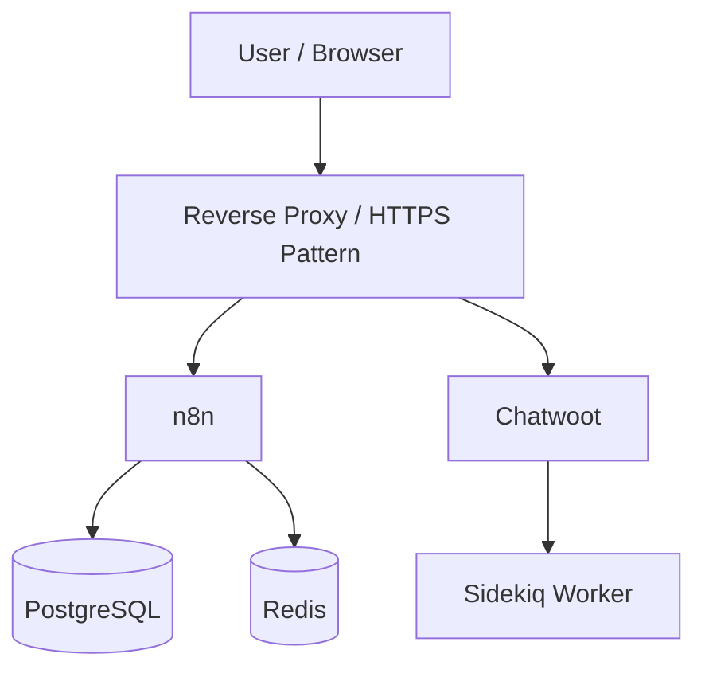

# Self-Hosted n8n Platform

**Status:** Independent infrastructure implementation  
**Stack:** Docker, Docker Compose, n8n, PostgreSQL, Redis, Traefik, HTTPS, Chatwoot  
**Pattern:** Self-hosted automation platform with persistence, reverse proxying, and supporting services

## Why this project is included

Many automation portfolios show only workflows inside a managed editor. This project documents the infrastructure underneath the automation work.

The goal was to run n8n in self-hosted environments and gain practical experience with persistence, supporting services, reverse proxying, and troubleshooting.

## Architecture

This diagram represents the wider platform pattern. The recovered evidence comes from multiple self-hosted environments rather than one single all-in-one production stack.

## Components demonstrated across the environments

### n8n
Workflow orchestration and execution environment.

### PostgreSQL
Persistence used in the wider self-hosted automation architecture.

### Redis
Supporting service present in the broader automation / messaging environment.

### Traefik
Reverse-proxy and HTTPS/custom-domain deployment patterns documented in the production-style hosting work.

### Chatwoot
Messaging/support platform used in the wider WhatsApp/customer-conversation automation environment.

## Operational experience demonstrated

- repeated Docker-based n8n setup
- persistent Docker volumes
- Docker Compose / multi-service architecture
- PostgreSQL and Redis platform components
- container networking and service connectivity
- Chatwoot + Sidekiq environment exposure
- reverse-proxy patterns
- HTTPS and custom-domain deployment patterns
- troubleshooting self-hosted services
- workflow backup/recovery awareness

Detailed environment-by-environment evidence: [`DEPLOYMENT_EVIDENCE.md`](./DEPLOYMENT_EVIDENCE.md)

## Evidence boundary

An older development environment contained approximately 21 workflows. That number describes the recovered development environment, not 21 independently verified production deployments.

The portfolio also keeps separate the plain local Docker n8n setup, the wider Chatwoot messaging stack, and the production-style Traefik/HTTPS hosting pattern rather than merging all components into one unsupported claim.

## Production hardening considerations

A real production deployment should additionally address items such as:

- secrets management
- backups and restore testing
- resource limits
- monitoring and alerting
- container image pinning and update strategy
- database maintenance
- log retention
- network exposure
- access controls

Those considerations are separated from the portfolio evidence so the project does not imply controls that were not explicitly verified.

## Skills demonstrated

- Docker
- Docker Compose
- self-hosted n8n
- PostgreSQL
- Redis
- Traefik
- reverse proxying
- HTTPS deployment patterns
- Chatwoot infrastructure
- platform troubleshooting
- automation-platform operations
