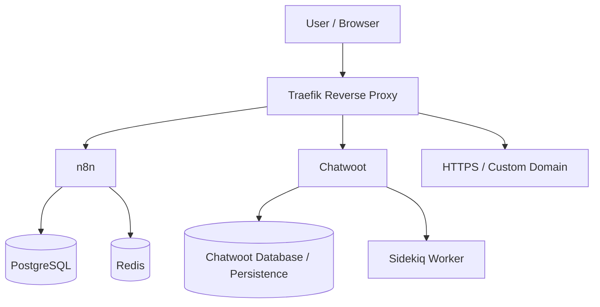

# Self-Hosted n8n Platform

**Status:** Independent infrastructure implementation  
**Stack:** Docker, Docker Compose, n8n, PostgreSQL, Redis, Traefik, HTTPS, Chatwoot  
**Pattern:** Self-hosted automation platform with persistence, reverse proxying, and supporting services

## Why this project is included

Many automation portfolios show only workflows inside a managed editor. This project documents the infrastructure underneath the automation work.

The goal was to run n8n in a self-hosted environment and gain practical experience with the services, persistence, networking, reverse proxying, and troubleshooting involved in operating the platform.

## Architecture

## Components

### n8n
Workflow orchestration and execution environment.

### PostgreSQL
Persistent database layer used instead of relying on an ephemeral workflow container.

### Redis
Supporting service used within the broader automation / messaging environment.

### Traefik
Reverse proxy used for routing and HTTPS-oriented deployment patterns.

### Chatwoot
Messaging and support platform integrated into the wider automation environment for WhatsApp/customer-conversation workflows.

## Operational experience demonstrated

- repeated Docker-based n8n setup
- Docker Compose service orchestration
- persistence planning
- container networking
- service-to-service connectivity
- reverse proxy configuration patterns
- HTTPS and custom-domain deployment patterns
- troubleshooting self-hosted services
- maintaining automation and messaging components in the same environment

## Evidence boundary

An older development environment contained approximately 21 workflows. That number describes the development environment, not 21 independently verified production deployments.

The defensible portfolio claim is that I built and operated a self-hosted n8n environment and used it for hands-on automation work, including messaging and CRM-style workflows.

## Production hardening considerations

A real production deployment should additionally address items such as:

- secrets management
- backups and restore testing
- resource limits
- monitoring and alerting
- container image pinning and update strategy
- database maintenance
- log retention
- network exposure
- access controls

Those considerations are separated from the portfolio evidence so the project does not imply controls that were not explicitly verified.

## Skills demonstrated

- Docker
- Docker Compose
- self-hosted n8n
- PostgreSQL
- Redis
- Traefik
- reverse proxying
- HTTPS deployment patterns
- Chatwoot infrastructure
- platform troubleshooting
- automation-platform operations
